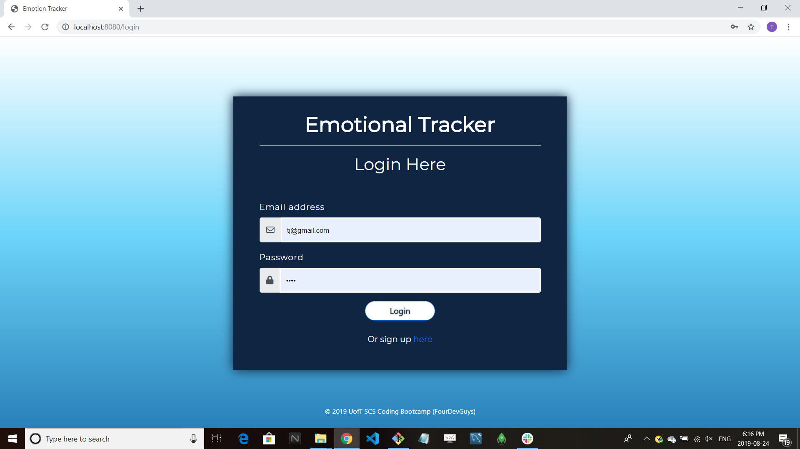
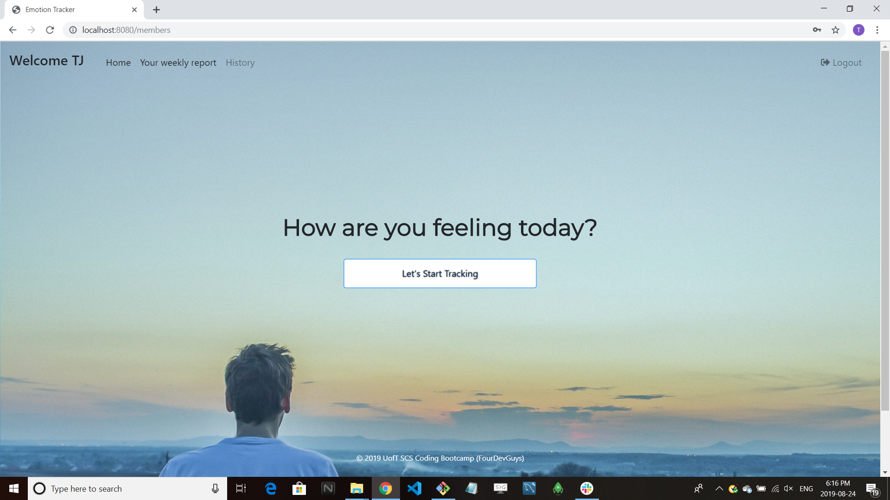
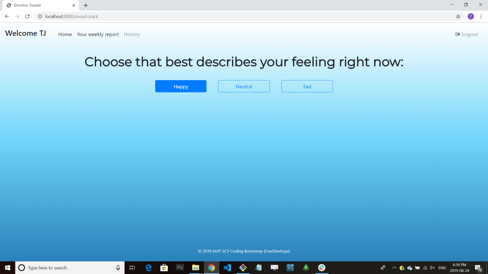
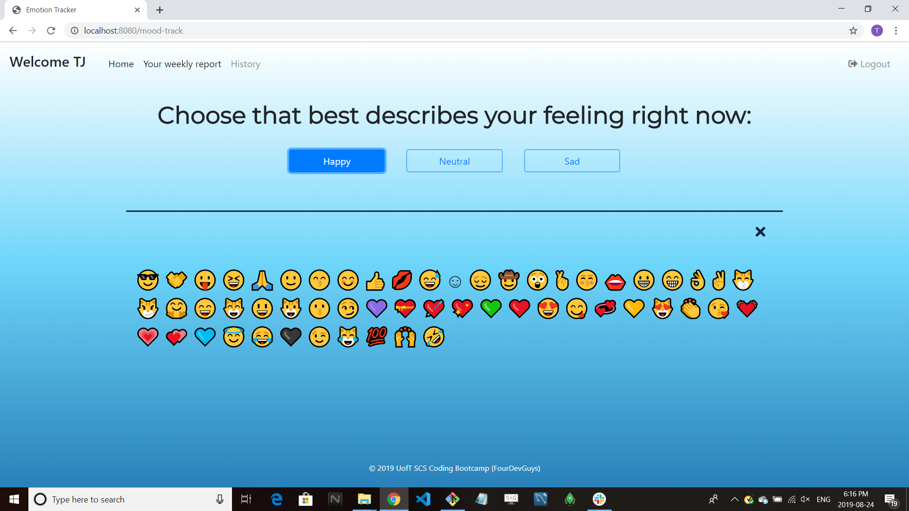
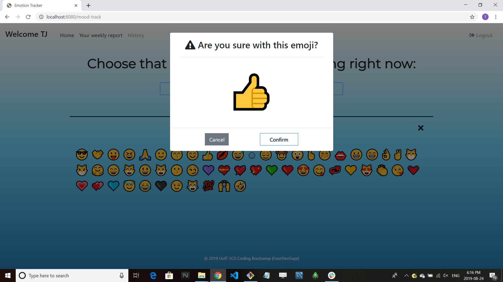
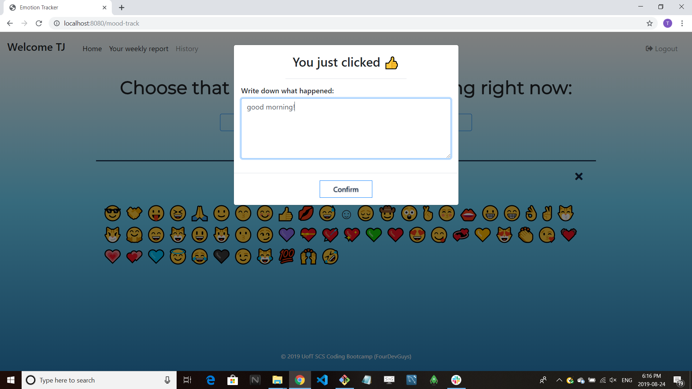
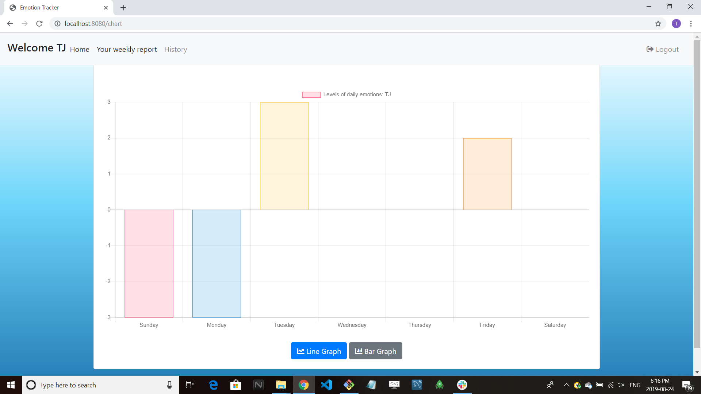
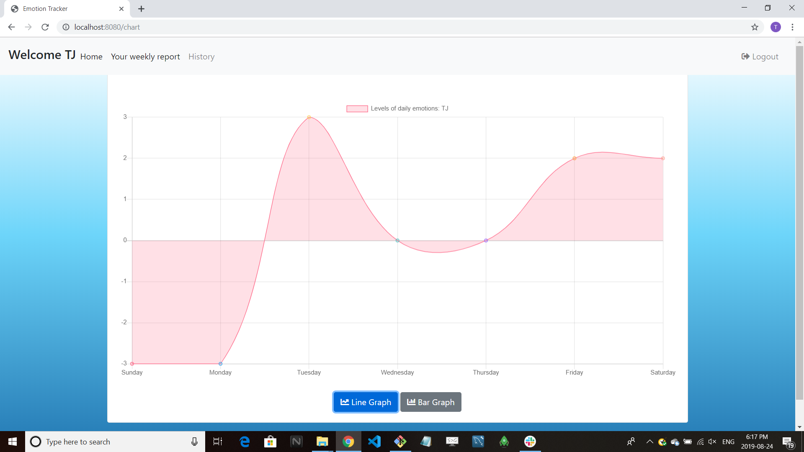

# Emoji Mood Tracker

Emoji Mood Tracker is an app to help you find your mood at the moment.

Registered users can Add multiple time and track your weekly changes.

Find it live on the web here

https://intense-hamlet-53439.herokuapp.com

## Background

Many people have been a heavy user of [1 Second Everyday](https://1se.co/), where our team created a very personal emotion tracker. 

We wanted a way to track our overall emotion in our life, allowing to monitor and add comments. 

## How it works

It's a simple 

- Register your Email 
- Click the Emoji what is same as your feeling
- If users want, they can add they note
- User can find their mood changes weekly

## Key Technologies Used

- HTML
- JavaScript
- Node.js
- Express
- Chart.js
- Mysql
- Sequilze
- CSS
- Handlebar

## Sample images

### Home

### Emoji Page

### Emoji Choose and Comment 

### Chart 

## Authers
- Raj (https://rajkumarshahu.com)
- Mo (https://mjuseph.github.io)
- Hally (https://itshally.github.io)
- TJ (sincerity0113@gmail.com)